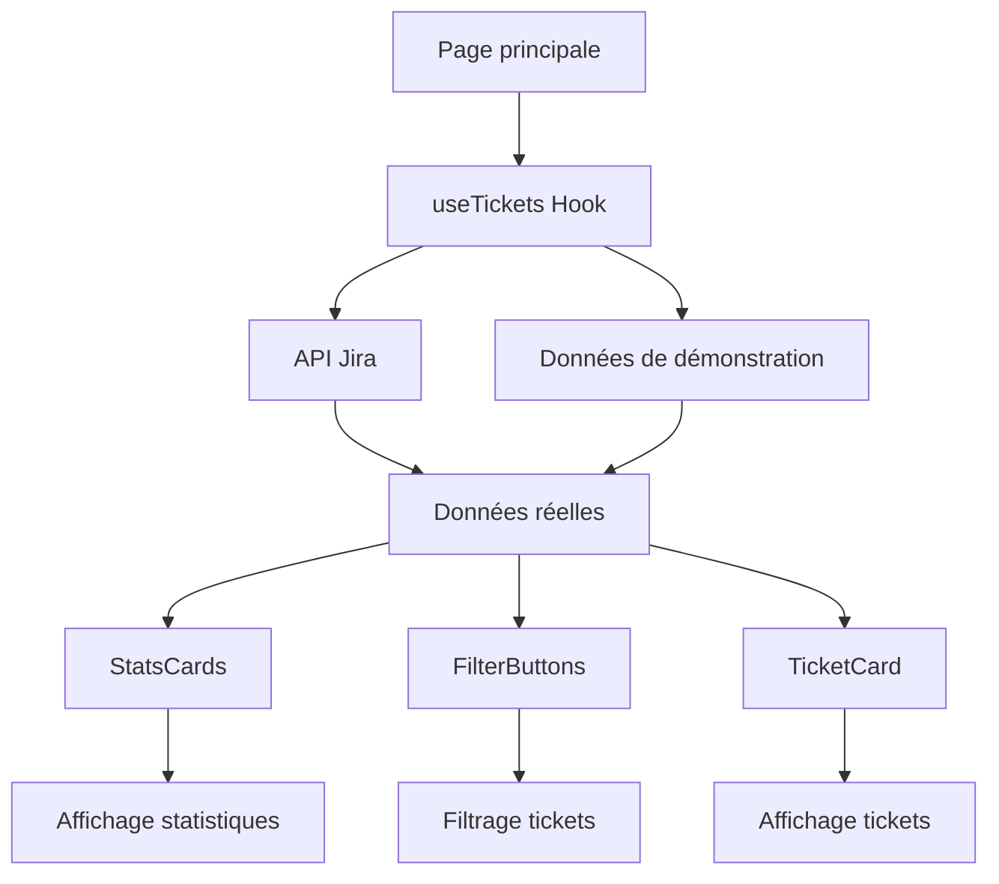

# Architecture du Tableau de bord Jira

## Vue d'ensemble

Le tableau de bord Jira est une application Next.js 15 construite avec une architecture modulaire et des composants réutilisables.

## Structure du projet

```
app/
├── components/           # Composants UI réutilisables
│   ├── LoadingSpinner.tsx    # Indicateur de chargement
│   ├── ErrorAlert.tsx        # Gestion des erreurs
│   ├── StatsCards.tsx        # Cartes de statistiques
│   ├── FilterButtons.tsx     # Boutons de filtrage
│   ├── TicketCard.tsx        # Carte de ticket individuel
│   └── EmptyState.tsx        # État vide
├── hooks/                # Hooks personnalisés
│   └── useTickets.ts         # Gestion des données tickets
├── config/               # Configuration
│   └── env.ts               # Variables d'environnement
├── types/                # Types TypeScript
│   └── index.ts            # Types globaux
├── constants/            # Constantes
│   └── index.ts            # Configuration et constantes
├── globals.css           # Styles globaux
└── page.tsx              # Page principale
```

## Flux de données



## Composants principaux

### 1. Page principale (`page.tsx`)
- Point d'entrée de l'application
- Gestion de l'état global
- Orchestration des composants

### 2. Hook `useTickets`
- Gestion des données des tickets
- Appels API avec gestion d'erreur
- États de chargement et d'erreur
- Filtrage des données

### 3. Composants UI

#### `LoadingSpinner`
- Animation de chargement
- Effets visuels avancés
- Messages personnalisables

#### `ErrorAlert`
- Affichage des erreurs
- Possibilité de fermeture
- Design responsive

#### `StatsCards`
- Cartes de statistiques
- Animations d'entrée
- Indicateurs visuels

#### `FilterButtons`
- Boutons de filtrage
- États actifs/inactifs
- Icônes et couleurs

#### `TicketCard`
- Affichage d'un ticket
- Actions au survol
- Design responsive

#### `EmptyState`
- État vide
- Suggestions d'actions
- Design engageant

## Gestion des états

### États globaux
- `tickets`: Liste des tickets
- `loading`: État de chargement
- `error`: Gestion des erreurs
- `filter`: Filtre actuel

### États locaux
- États des composants individuels
- Animations et transitions
- Interactions utilisateur

## Configuration

### Variables d'environnement
```typescript
NEXT_PUBLIC_JIRA_TOKEN=token_api
NEXT_PUBLIC_JIRA_EMAIL=email@exemple.com
NEXT_PUBLIC_JIRA_URL=https://api.jira.com/endpoint
```

### Configuration TypeScript
- Types stricts pour toutes les interfaces
- Validation des données
- IntelliSense complet

## Styles et thème

### Tailwind CSS
- Classes utilitaires
- Design responsive
- Animations fluides

### CSS personnalisé
- Animations keyframes
- Effets de glassmorphism
- Scrollbar personnalisée

## Performance

### Optimisations
- Lazy loading des composants
- Mémorisation des calculs
- Animations CSS optimisées

### Gestion des erreurs
- Fallback sur données de démonstration
- Messages d'erreur informatifs
- Retry automatique

## Sécurité

### Variables d'environnement
- Configuration sécurisée
- Pas de données sensibles dans le code
- Validation des entrées

### API
- Authentification Basic
- Gestion des timeouts
- Retry automatique

## Tests

### Structure recommandée
```
__tests__/
├── components/
│   ├── LoadingSpinner.test.tsx
│   ├── ErrorAlert.test.tsx
│   └── ...
├── hooks/
│   └── useTickets.test.ts
└── utils/
    └── helpers.test.ts
```

## Déploiement

### Build de production
```bash
npm run build
npm start
```

### Variables d'environnement
- Configuration en production
- Secrets management
- Monitoring des erreurs

## Évolutions futures

### Fonctionnalités possibles
- Recherche avancée
- Tri des colonnes
- Export des données
- Notifications en temps réel
- Mode sombre
- Internationalisation

### Améliorations techniques
- Tests unitaires
- Tests d'intégration
- Storybook pour les composants
- Monitoring des performances
- Cache des données
